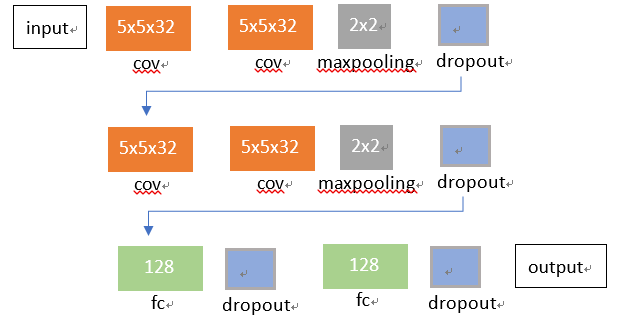

# Udacity_SDC_P3_Behavioral-Cloning

[//]: # (Image References)
[image1]: ./images/Architecture.PNG "architecture"
[image2]: ./images/resizing_and_cropping.png "Resized and crooped image"
[image3]: ./images/steering_hist.png "steering hist"
[image4]: ./images/steering_hist_flipped.png "steering hist balanced"
[image5]: ./images/augmentation.png "augmentated image"
[image6]: ./images/filter.png "filter example"

This is the third project for Udacity Self-Driving Car Engineer Nanodegree. For this project, we need to control a car in a simulator to collect camera images and steering angles, and then using this information to build a model to predict the steering angles based on the recorded camera images. The model learns from the data generated from the way we drive the car, hence the name.

The projects includes the following files:
* model.py - this is the file to create and train model. See the comments in the the file for explanation  
* model.h5 - a traned cnn for predicting the steering angle from the camera images 
* drive.py - for driving the car autonomously in the simulator. Added a function to resize the input images
* README.md - the file reading now
* test_recording.mp4 - a video which shows the car driving autonomously by the trained cnn model

Make sure Opencv is installed before running the script.

### Running the code
To test the model, launch the Udacity simulator and execute
```
python drive.py model.h5
```
Make sure Opencv is installed before running the script

## Model architecture
The archtecture is a convolutional neural netowrk based on the architecture of VGG net. In order to be able to train the model in a fair amount of time, I started from a smaller network and gradually expand the nodes for each layer and the number of layers until the model can drive around the track successfully. One interesting thing I found is that the number of filter is crucial for the car to make a big turn. The fianl archtecture is shown below:



It is an eight-layers convolunal networtk. The first part is two 5x5x32 convolutional layers followed by a 2x2 maxpooling layer, and the second part is two 3x3x64 convolutional layers followed by a 2x2 maxpooling layer. The final part is two fully-connected layers. ReLU is the activation function for each layer, and the dropout is used for reducing the overfitting. 

Here is an example of the features extracted by the convolutional layers.

![][image6]

## Training strategy
The training data was collected by driving around the track in the designated direction for three laps and one lap in the opposite direction. The number of total training sample is 10512. The data provided by Udacity was used for validation, which has 8036 instances.

### Balancing the data
The data collected by the above method is biased toward the negative steering angle, as we can see from the figure below. This may make the model more likely to predict a negative steering angle.

![][image3]

To fix this issue, we added the images flipped horizontally from the original images and change the sign of the steering angles. This effectively doubles the number of training samples and balances the count of the steering angles, as shown below.

![][image4]

Moreover, we can see from the above histogram that even we flipped the images to balance the positives and negatives, the small angles near zero are still dominated. This causes the model more likely to predict small steering angle. To alleviate this problem, the data is resampled based on the probability calculated from the inverse of the counts in the histogram.

### Image preprocessing 
The size of the original camera images are 160x320x3. The images are resized to 96x96x3 and further cropped to 55x96x3, as shown below. The pixel values are normlized to [0,1] before feeding into the network.

![][image2]

When feeding the images into the network, they are not only flipped but also randomly rotated and shifted. This effectively creates more variation for each batch.

![][image5]

### choosing the training parameters
When training the network, we use Adam optimizer with learning rate = 0.0001. The batch size is 128. The epoch is chosen to be 3 based on the validation error. 

## Simulation result
The car is able to drive autonomously around the first track, as shown in the video (test_recording.mp4). 


